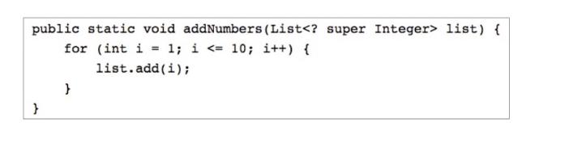
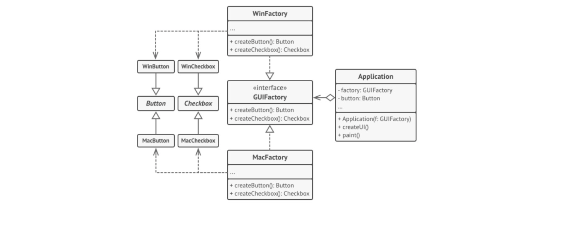
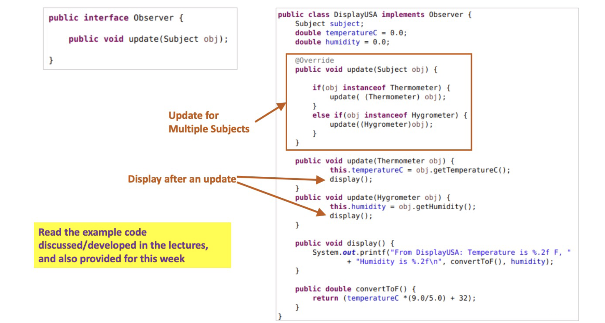

# Object Oriented Programming (OOP) 

- In procedural programming (like 'C') programming tends to be action-oriented whereas in java - programming is object oriented.

### Procedural Programming:
- Groups of actions that perform some task are formed into functions and functions are grouped to form programs

### Object Oriented Programming:
- Programmers concentrate on creating their own user defined types called **classes**
- Each class contains data as well as the set of **methods (procedures)** that manipulate the data.
- An instance of a class is called an **object**.
- OOP **encapsulates data (attributes) and methods (behaviours)** into objects, the data and methods of an object are intimately tied together. 
- Objects have a property of information hiding. 

## Inheritance
- **Inheritence** is a form of software reusability in which new classes are created from the existing classes by absorbing their attributes and behaviours
- Instead of defining a completely (seperate) new class, the prorgammer can designate the new class to **inherit** attributes and behaviours of the existing class (called the **super-class**). This new class is referred to as a **sub-class**.
- Inheritance relationships form tree-heirarchal structures.


## "Is-a" Relationship
- In an "in-a" relationship, an object of a subclass may also be treated as an object of a superclass.
- For example, an ```UndergraduateStudent``` can be treated as a ```Student``` too.

## "Has-a" Relationship
- In a "has-a" relationship, a class object has an object of another class
- For example a Rectangle is NOT a Line. However, we may use a Line to draw a Rectangle.
- "Has-a" relationships are examples of creating new classes by **composition** of existing classes.

## Classes and Objects
- A class is a collection of data and methods (procedures) that operate on that data.
- Always try to keep data private (local).
- Objects are instances of classes
```
Circle c = new Circle();
```

## Accessing Data Object
```
c.x = 2;
c.y = 5;
c.z = 1;
```

## Using Object Methods
```
Circle c = new Circle();
a = c.area();
```
## Subclasses and Inheritance: *First Approach*
 - We are creating a new seperate class for ```GraphicalCircle``` and rewriting the code already available in the class ```Circle```.
 ```
 public class GraphicalCircle {
    int x, y, r;
    Color outline, fill;

    public double circumference() {
        return 2 * 3.14159 * r;
    }
    public double area() {
        return 3.14159 * r * r;
    }

    public void draw(Graphics g) {
        g.setColor(outline);
        g.drawOval(x-r, y-r, 2*r, 2*r);
        g.setColor(fill);
        g.fillOval(x-r, y-r, 2*r, 2*r);
    }
 }
 ```

 ## Subclasses and Inheritance: *Second Approach*
 - We are creating the ```GraphicalCircle``` class so that it makes use of the ```Circle``` class.

 ```
public class GraphicalCircle2 {
    Circle c;
    Color outline, fill;

    public GraphicalCircle2() {
        c = new Circle();
        this.outline = Color.black;
        this.fill = Color.white;
    }

    public GraphicalCircle2 (int x, int y, int r, Color o, Color f) {
        c = new Circle(x, y, r);
        this.outline = o;
        this.fill = f;
    }

    public void draw(Graphics g) {
        g.setColor(outline);
        g.drawOval(c.x-c.r, c.y-c.r, 2*c.r, 2*c.r);
        g.setColor(fill);
        g.fillOval(c.x-c.r, c.y-c.r, 2*c.r, 2*c.r);
    }
 }
 ```

  ## Subclasses and Inheritance: *Third Approach*
  - We define ```GraphicalCircle``` as an extension or subclass of ```Circle```.

  ```
public class GraphicalCircle extends Circle {

    Color outline, fill;
    public GraphicalCircle() {
        this.outline = Color.black;
        this.fill = Color.white;
    }

    public GraphicalCircle(int x, int y, int r, Color o, Color f) {
        super(x, y, r);
        this.outline = o;
        this.fill = f;
    }

    public void draw(Graphics g) {
        g.setColor(outline);
        g.drawOval(x-r, y-r, 2*r, 2*r);
        g.setColor(fill);
        g.fillOval(x-r, y-r, 2*r, 2*r);
    }
 }
 ```

 ## Super Classes, Objects and the Class Heirarchy

- Every class has a superclass
- If we don't define the superclass, by default the superclass is the class ```Object```.

```Object``` Class:
- The only class with no superclass
- The methods defined by ```Object``` can be called by any Java object (instance).
- Often we need to override the following methods:
  - ```toString()```
  - ```equals()```
  - ```hasCode()```

## Abstract Classes
- We can decalre classes that define **only** part of an implementation.
- Extended classes provide speciifc implementation of some or all the methods.

The benefit of an **abstract** class:
- methods may be dedlared such that the programmer nkows the interface definition of an object.
- methods can be implemented differently in different subclasses of the abstract class.

Some rules about abstract classes:
- an abstract class is a class that is declared abstract.
- If a class includes abstract methods, then the class itself must be declared abstract.
- An abstract class cannot be instantiated.
- A subclass of an abstract class cna be instantiated if it overrides each of the abstract methods of its superclass and provides an **implementation** for all of them.
- If a subclass of an abstract class does not implement all the abstract methods it inherits, that subblass is itself abstract. 

```
public abstract class Shape {
    public abstract double area();
    public abstract double circumference();
}

public class Rectangle extends Shape {
    protected double width, height;

    public Rectangle() {
        width = 1.0;
        height = 1.0;
    }

    public Rectangle(double w, double h) {
        this.width = w;
        this.height = h;
    }

    public double area() {
        return width * height;
    }

    public double circumference() {
        return 2 * (width + height);
    }
}
```
## Single Inheritance versus Multiple Inheritance
- In Java a new class can extend exactly one superclass - a model known as single inheritance
- some objected-oritnted languages employ multiple inheritance, where a new class can have two or more super classes.
- Can employ mulitple inheritance in Java using interfaces.

## Interfaces
- Interfaces are like abstract classes, but with few important differences.
- All the methods defined within an interface are **implicitly abstract**
- Variables declared in an interface must be **static and final**, that means they must be constants.
- Just like a class **extends** its superclass, it also can optionally **implements** an interface.
- In order to implement an interface, a class must first declare the interface in an **implements** clause, and then it must provide an implementation for all of the abstract methods of the interface. 
- A class can **implements** more than one interfaces

```
public interface Drawable {
    public void setColor(Color c);
    public void setPosition(double x, double y);
    public void draw(Graphics g);
}

public class DrawableRectangle 
                extends Rectangle
                implements Drawable {
    
    private Color c;
    private double x, y;

    public void setColor(Color c) {
        this.c = c;
    }
    public void setPosition(double x, double y) {
        this.x = x;
        this.y = y;
    }
    public void draw(Graphics g) {
        g.drawRect(x,y,w,h,c);
    }

}
```

## Extending Interfaces
- Interfaces can have **sub-interfaces**, just like classes can have subclasses.
- A sub-interface **inherits all** the abstract methods and constraints of its super-interface, and may define new abstract methods and constants.
- Interfaces **can extend** more than one interface at a time.

```
public interface Transformable
        extends Scalable, Rotable, Reflectable {}

public interface DrawingObject
        extends Drawable, Transformable {}
```


## Method Forwarding
- The practice of a method simply calling another method, from another class or from its superclass.

```
public class Engine {
    public void start() {
        System.out.println("Engine Started.");
    }
}

public class Car {
    private Engine engine  = new Engine();

    // This method forwards the call to Engine's start method
    public void start() {
        engine.start();
    }
}
```

## Method Overriding (Polymorphism)
- When a class defines a method using the same name, return type and by the number, type and position of its arguments as a method in its superclass, the method in the class overrides the method in the superclass.
- If a method is invoked for an object of the class, it's the new definition of the method that is called, and not the superclass's old definition.

### Polymorphism
- An object's ability to decide what method to apply to itself, depending on where it is in the inheritance heirarchy, is usally called polymorphism.

```
public class Animal {
    public void makeSound() {
        System.out.println("Animal namkes a sound");
    }
}

public class Dog extends Animal {
    @Override
    public void makeSound() {
        System.out.println("Dog barks");
    }
}
```

## Method Overloading
- Defining methods with the same name and different argument or return types is called method overloading.

```
public class Calculator {
    public int add(int a, int b) {
        return a + b;
    }

    public int add(int a, int b, int c) {
        return a + b + c;
    }

    public double add(double a, double b) {
        return a + b;
    }

    public String add(String a, int b) {
        return a + b
    }
}

public class Main {
    public static void main(String[] args) {
        Calculator calc = new Calculator();

        // Depending on parameters can use different methods
        System.out.println(calc.add(2, 3));
        System.out.println(calc.add(1, 2, 3));
        System.out.println(calc.add(2.5, 3.1));
        System.out.println(calc.add("Result: ", 3));
    }
}
```

## Data Hiding and Encapsulation
- We can hide data within the class and make it available only through the methods

#### Access Modifiers:

| Modifier | Same Class | Same Package | Subclass | Everyone |
-----------| -----------| -------------| ---------| ---------|
| public | X | X | X | X |
| protected | X | X | X |
| default | X | X |
| private | X |


## Constructors
- Good practice to **define** the requried constructors for all classes.
- If a constructor is not defined in a class,
  - **no-argument** constructor is implicily inserted.
  - this no-argument constructor invokes the superclass's no-argument constructor.
  - if the parent class (superclass) doesn't have a visible constructor with no-argument, it results in a compilation error.
- If the first statement in a constructor is not a call to **super()** or **this()**, a call to **super()** is implicitly inserted.
- If a constructor is defined with one or more arguments, no-argument constructor is not inserted in that calss.
- A class can have multiple constructors, with different signatures.

# Domain Modelling
- Domain Models are used to visually represent important domain concepts and relationships between them.
- Domain Models help clarify and communicate important domain specific concepts and are used during the requirements gathering and designing phase.
- Domain modelling is the activity of expressing related domain concepts
- Unified Modelling Language (**UML**) **class diagrams** will be used.

## Requirements Analaysis vs Domain modelling
- **Requirements analysis** determines *external behvaiour*
  - **"What are the features of the system to be and who requires these features"**
- **Domain modelling** determines *internal behaviour*
  - **"how elements of system to be interact to produce the external behaviour"**
- Requirements analsysis and domain modelling are **mutually dependent**.

## What is a domain?
- **Domain** - A sphere of knowledge particular to the problem being solved.
- **Domain expert** - A person expert in the domain.

## Attributes vs Classes
- If a concept is **not** representable by a number or string, it's most likely a class
- For example
  - a **lab mark** can be represented by a number, so we should represent it as an attribute.
  - a **student** cannot be represented by a number or a string, so we should represent it as a class.


## Defensive Programming vs Design by Contract
### Defensive Programming:
Tries to address unsofrseen circumstances, in order to ensure the continuing functionality of the software element.
- often used where high availability, safety or security is needed.
- results in redundant checks 
- more complex software for maintenance.
- difficult to locate errors, considering there is no clear demarcation of responsibilities.

### Design by Contract
Responsibilities are clearly assigned to different software elements, clearly documented and enforced during the development using unit testing and/or language support.
- clear demarcation of responsibilities helps prevent redundant checks, resulting in simpler code and easier maintenance.
- crashes if the required conditions are not satisified. 


## Design by Contract
Every software element should define a **specification** that governs its interaction with the rest of the world. A contract should address the following three questions.
1. Pre-condition - what does the contract expect?
    - If the precondition is true, it can avoid handling cases outside of the precondition
2. Post-condition - what does the contract guarantee?
    - Return value(s) is guaranteed, provided the pre-condition is true
3. Invariant - what does the contract maintain?
    - some values must satisfy constraints, before and after execution

A contract (pre-condition, post-condition, invariant) should be:
- **declarative** and must not include implementation details
- as far as possible: **precise, formal and verifiable**

## Benefits of design by Contract
- Do not need to do error checking for conditions that do not satisfy the preconditions
- Prevents redundant validation tasks
- Clients can expect the specified post-conditions
- Responsibilities are clearly assigned
- Helps in cleaner and faster development

## Design by Contract : Implementation Issues
- Java does not have native support by DbC
- Unit testing is used to test the contracts
- Often pre-conditions, post-conditions and invariants are included in the documentation

# Exceptions

- An exception is an event, which occurss during the execution of a program, that disrupts the normal flow of the program's instructions.
- When error occurs, an *exception* object is created and given to the runtime system, this is called **throwing** an exception.
- The runtime system searches the call stack for a method that contains a block of code that can **handle** the exception.
- The exception handler chosen is said to **catch** the exception.

The **Three Kinds** of Exceptions:
- Checked exception (IOException, SQLException)
- Error (VirtualMachineError, OutOfMemoryError)
- Runtime exception (ArrayIndexOutOfBoundsExceptions, ArithmeticException)

## Checked vs Uncheked Exceptions
- An exception's type determines whether it's checked or unchecked
- All classes that are subclasses of ```RuntimeException``` or ``Error`` are **unchecked** exceptions.
- All classes that inherit from class `Exception` but not directly or indirectly from class `RuntimeException` are considered to be checked exceptions.

## User Defined Exceptions 
- We can also create **user defined** exceptions
- All exceptions must be a child of `Throwable`
- A **checked** exception need to extend the `Exception` class, but not directly or indirectly from the class `RuntimeException`
- An **unchecked** exception needs to extend the `RuntimeException` class.

## User Defined / Custom Checked Exception


## Exceptions in Inheritance
- If a subclass method **overrides** a superclass method, a subclass's **throws** clause can contain a subset of a superclass's **throws** clause.
- It must not throw more exceptions

## Assertions 
- An **assertion** is a statement that enables you to test your assumptions about your program. Assertions are useful for checking:
    - Preconditions, Post-conditions, Class Invariants
    - Internal Invariants and Control-Flow invariants
- You shoul **not** use assertions:
    - for argument checking in **public methods**
    - to do any work that your application requires for correct operation.
- Evaluating assertions should not result in side effects

## Assert : Example


# Generics and Collections

## Generics
- Generics enables types (classes and interfaces) to be parameters when defining:
    - class
    - interfaces and
    - methods

Benefits:
- Removes casting and offers stronger type checks at compile time
- Allows implementation of generic algorthms, that work on collections of different types, can be customised and are type safe.
- Adds stability to your code by making more of your bugs detectable at compile time


## Generic Types
- A generic type is a generic class or interface that is parameterised over types
- A generic class is defined with the following format:
    - class name<T1, T2, ..., Tn> {/*...*/}


## Multiple Type Parameters
- A generic class can have multiple type parameters
- For example, the generic `OrderedPair` class, which implements the generic `Pair interface


## Generic Methods
- Generic methods are methods that introduce their own type parameters


## Bounded Type Parameters
- There may be times when you want to restrict the types that can be used as type arguments in a parameterised type.
- For example, a method that operates on numbers might only want to accept instances of `Number` or its subclasses.


## Multiple Bounds
- A type parameter can have multiple bounds
    - < T extends B1 & B2 & B3 >
- A type variable with multiple bounds is a subtype of all the types listed in the bound.
- Note that B1, B2, B3 in the above order refer to **instances** or a **class**. There can be at most one class (single inheritance) and the rest (or all) will be interfaces.
- If one of the bounds is a class, it must be specified first


## Generic Methods and Bounded Parameter Types


## Generics, Inheritance and Subtypes
- Consider the following method:
    - `public void boxTest(Box<Number> n){/*...*/}`
- What type of argument does it accept?
- Are you allowed to pass in `Box<Integer> or Box<Double>`
- The answer is **"no"** because `Box<Integer>` and `Box<Double>` are **not** subtypes of `Box<Number>`


## Generic Classes and Subtyping
- You **can subtype** a generic class or interface by extending or implementing it.
- The relationship between the type parameters of one class or interface and the type parameters of another are determined by the **extends** and **implements** clauses.
- `ArrayList` implements `List<E>` and `List<E>` extends `Collection<E>`
- So  `ArrayList` is a subtype of `List<String>` which is a subtype of `Collection<String>`
- So long as you **do not vary the type** argument, the subtyping relationship is preserved between the types.


## Wildcards: Upper Bound
- In generic code, the question mark (?), called the **wildcard**, represents an unknown type.
- The wildcard can be used in a **variety of situations**: as the type of paramter, field or local variable; sometimes as a return type.
- The **upper bounded wildcard**, `<? extends Foo>`, where `Foo` is any type, matches `Foo` and the subtype of `Foo`.
- You can specify an upper bound for a wildcard, or you can specfiy a lower bound, but you **cannot specify both**.


## Wildcards: Unbounded
- The unbounded wildcard type is specified using the wildcard character (?), for example, `List<?>`. This is called a list of unknown type.


## Wildcards: Lower Bounded
- An **upper bounded wildcard** restricts the unknown type of a specific type or a subtype of that type ad its represented using the **extends** keyword.
- A **lower bounded wildcard** is expressed using the wildcard character ('?), following by the **super** keyword, followed by its lower bound: `< ? super A >`
- To write the method that works on lists of Integer and the super types of Integer, such as **Integer, Number and Object** you would specifiy `List<Super Integer>`



## Wildcards and Subtyping
- Although Integer is a subtype of Number, `List<Integer>` is not a subtype of List<Number> and these two types are **not related**.
- The common parent of `List<Number>` and `List<Integer>` is `List<?>`


## Collections in Java
- A collections framework is a unified architecture for representing and manipulating collections. A collection is simply an object that groups multiple elements into a single unit.

All collections frameworks contain the following:
- **Interfaces**: Allows collecions to be manipulated independently of the details of their representation
- **Implementations**: concrete implementations of the collection interfaces. 
- **Algorithms**: the methods that perform useful computations, such as searching and sorting, on objects that implement collection interfaces.

## Core Collection Interfaces:
- The core collection interfaces encapsulate different types of collections
- The interface allow collections to be manipulated independently of the details of their representation.


## The Collection Interface
- A **Collection** represents a group of objects known as elements.
- The **Collection interface** is used to pass around collections of objects where maximum generality is desired.
- The **Colletion interface** contains methods that perform basic operations, such as 
    - int **size()**
    - boolean **isEmpty()**
    - boolean **contains(Object element)**

## Collection Implementations


# Software Design Principles

## What Goes Wrong in Software Design?
- Initial design is clean and elegant, often well-structured
- Over time, design degrades due to evolving requirements and rushed changes
- Known as "software rot" this process makes code hard to maintain and evolve

Symptoms:
- **Rigidity**: Small changes cause widespread impact
- **Fragility**: One change breakes unrelated parts.
- **Immobility**: Useful components can't be reused easily.
- **Viscosity**: Environment or process ncourages hacks over clean design.

## Rigidity and Fragility
Rigidity: System resists changes due to interdependencies
    - Example: A login module change forces updates in unrelated reporting or database modules.
    - Impact: Managers hesitate to allow even minor fixes.

Fragility: Changes result in unexpected breakages.
- Example: Fixing an email validator crashes the profile picture upload feature.
- Impact: Developer trust and morale drop; testing becomes difficult

Observation: The aboe are due to poor dependecny management, not just evolving requirements

## Immobility and Viscosity
**Immobility**: Modules can't be reused due to tight coupling.
- Example: A "UserNotification" class depends on web framework internals, so we cannot reuse in CLI app.

**Design viscosity**: Easier to do the wrong thing than the right thing
**Environmental viscosity**: Long compile/test cycles encourage shortcuts
- Example: Hack a feature with global variables instead of refactoring due to 20-minute build time.

Observation: Most symptoms of rot are caused by bad dependency structures

## What are Software Design Principles
- They provide guidelines to develop systems that are maintainable, flexible, reusable, and robust.
- Adhering to these principles helps to mitigate common software engineering issues such as design rot and ensures software remains scalable and adaptable over time
- Changin requirements don't have to ruin design
- Good design anticipates change, however bad design breaks under it.

## Importance of Software Design Principles
- **Maintainability**: Software should be easy to update and enhance without extensive refactoring
- **Flexibility**: Systems should adapt smoothly to changing requirements
- **Reusability**: Components and modules should be designed to be easily reusable across various parts of the application or even in different projects.
- **Robustness**: The software should handle errors gracefully and maintain functionality under different circumstances.

## SOLID Principles

Single Responsibility Principle (SRP):
- A class should only have one reason to change, refactoring on a single functionality

Open/Closed Principle (OCP)
- Software entities should be open for extension but closed for modification

Liskov Substiution Principle (LSP):
- Objects of a superclass should be replacable with objects of subclasses without affecting the correctedness of the program

Interface Segregation Principle (ISP):
- Clients should not be forced to depend on interfaces they do not use; favor many soecufuc interfaces over a single general-purpose one.

Dependency Inversion Principle (DIP):
- Depend on abstractions, not concrete implementations. Higher level modules should not depend on lower-level modules but rather on abstractions

## Why Follow These Principles?
- Preventing Software Rot
- Ease of Maintenance
- Enhanced Productivity
- Improved Collaboration

## Software Cohesion and Coupling
- **Cohesion**: The degree to which elements of a module/class belong together
- **Coupling**: The degree of interdependence between software modules.
- High choesion and low coupling are hallmarks of good software design.

## Principle of Least Knowledge (Law of Demeter)
- Suggests that a module should only talk to its immediate "friends" and not to strangers
- Only call methods on objects you directly know
<br> 
Formal Rule:
- A method M of an object O may only invoke methods that belong to:
    - O itself
    - M's parameters
    - Any objects created/instantiated within M
    - O's direct fields (its own instance variables)

## Covariance and Contravariance
- **Covraince**: Return type can be more specific (subtype)
- **Contravariance**: Parameter types can be more general (supertype)


# Junit Testing

## JUnit
- JUnit is a popular unit testing (open source) framework for testing Java programs

Basic Junit Terminology:
- **Test Case** - Java class containing test methods
- **Test Method** - a method that executes the test code, annotated with @Test, in a Test Case
- **Asserts** - asserts or assert statements check an unexpected result versus the actual result
- **Test Suites** - collection of several Test Cases

# Refactoring
- Refactoring is the process of restructuring existing code without changing its external behaviour

Aim is to:
- improve internal structure/design, readability and maintainability
- help detect bugs
- increase developmental speed.
- help conform to design principles and eliminate design/code smells

## When to Refactor
- Before adding new features if current structure is not suitable
- While fixing bugs
- During code reviews

## Code Smells
- Code smells are indicators of potential design issues
- They hint at poor design but do not gurantee defects
- Refactoring addresses code smells

## Refactoring Technique: Extract Method


## Refactoring Technique: Move Method
- Move methods to the class whose data they use most.


## Refactoring Technique: Replace Temp with Query 
- Move expressions into methods instead of temporary variables


## Refactoring Technique: Replace Conditional with Polymorphism


## Refactoring using Composition


## Design Smell: Refused Bequest
- Subclass inherits inappropriate behaviour.


## Smell: Long parameter List
- To avoid long paramter lists, encapsulate related paramters into a data class and pass and instance of that class instead


## Smell: Large Method/Class
- **Large Method**: method with many lines doing multiple things
- Refactor: use **Extract Method** to create new method(s)
- Large Class: Class with 20+ methods and many fields
- Refactor: use **Extract Class** to seperate concerns

## Smell: Similar Code Fragments
- Case 1: Same code in multiple methods of the same class
  - Use Extract Method and invoke it from each price <br>
- Case 2: Same code in two subclasses of the same level
    - Use Extract Method in both subclasses, Use Pull Up Field or Pull Up Method to unify code in the superclass
    - If inside constructors: use Pull Up Constructor Body.
    - For similar but not identical code: use Template Method
    - If algorthms differ, use Strategy Pattern
- Case 3: Duplicate code in unrelated classes
    - Use Extract Superclass to unify shared logic

## Smell: Feature Envy
- A method is more interested in another class's data than its own

Symptoms
- The method invokes several methods on another object to calculate a value
- Causes unnecessary coupling and breaks encapsulation

Solution
- Move the method to the class that owns the data

## Smell: Divergent Change
- A class is changed in many unrelated ways for different reasons
- Violates Single Responsibility Principle
- Increases risk of regression bugs due to unrelated modifications

Solution:
- Identify reasons for change and seperate them into cohesive classes
- Use Extract Class to encapsulate each responsibility

## Smell: Shotgun Surgery
- A Small change requires updating many different classes.
- Makes code brittle and hard to maintain

Solution:
- Consolidate related changes into a single class
- Use Move Method, Move Field, or Inline Class to localise the change.


# Introduction to Software Patterns and Strategy Pattern

## What are Design Patterns?
- Proven solutions to common software design problems
- Reusbale templates that help structure software
- Provide shared vocabulary for developers

# Strategy Pattern
- Define a family of algorithms
- Encapsulate each algorithm in a separate strategy class
- Make algorithms interhchangeable in the context object
- Vary behaviour without changing the context class


# Composite Pattern

## Composite Pattern
- A composite is an object designed as a composition of one-or-more similar objects


## Composite Pattern: Possible Solution
- Define a unified `Component` interface for both
- `Leaf` (single/part) objects and `Composite` (Group/whole) objects
- A Composite stores a collection of children components (either `Leaf` and/or `Composite` object)


## Implementation Issue: Uniformity vs Type Safety


Design for **Uniformity**
- Include all child-related operations in the `Component` interface, this means the `Leaf` class needs to implement these methods with "do nothing" or "throw exception"
- a client can treate both `Leaf` and `Composite` objects uniformly
- we loose type safety because `Leaf` and `Composite` types are not cleanly seperated
- useful for dynamic structures where children types change dynamically and a client needs to perform child-related operations regularly. <br>

Design for **Type Safety**
- only defined child-related operations in the `Composite` class
- the type system enforces type constraints, so a client cannot perform child-related operations on a `Leaf` object
- a client needs to treat `Leaf` and `Composite` objects differently
- useful for static structures where a client doesn't need to perform child-related operations on "unknown" objects of type `Component`

# Factory Method
- Factory Method is a creational design pattern that uses factory methods to deal with the problem of creating objects without having to specify the exact class of the object that will be created.

#### Problem
- Creating an object directly within the class that requires the object is inflexible
- It commits the class to a particular object and makes it impossible to change the instantiation independently from the class

### Possible Solution
- Define a seperate operation (factory method) for creating an object
- Create an object by calling a factory method
- This enables writing of subclasses to change the way an object is created.


## Abstract Factory Method
- Intent: Abstract Factory is a creational design pattern that lets you produce families of related objects without specifying their concrete classes.





# Observer Pattern

## Observer Pattern
- The Observer Pattern is used to implement distributed event handling systems, in "event driven" programming.
- In the observer pattern
    - an object, called the **subject** maintains a list of its dependents called **observers** 
    - **notifies** the observers **automatically** of any state changes in the subject usually by calling one of their methods
- Defines a one-to-many dependency between objects so that when one object changes state, all of its dependents are notified and updated automatically.
- The aim should be to
    - Define a one-to-many dependency between objects without making the objects **tightly coupled**
    - automatically notify/update an open-ended number of observers when the subject changes state
    - be able to dynamically add and remove observers

## Observer Pattern: Possible solution
- Define Subject and Observer interfaces, such that when a subject changes state, all registered observers are notified and updated automatically.
- The responsibility of,
    - a subject is to maintain a list of observers and to notify them of state changes by calling their `update()` operation.
    - observers is to register (and unregister) themselves on a subject and to update their state when they are notified.
- This makes subject and observers loosely coupled
- Observers can be added and removed independently at run-time
- This notification-registration interaction is also known as publish-subscribe


## Passing data: Push or Pull
- The subject needs to pass (change) data while notifying a change to an Observer. Two possible options,

### Push data
- Subject passes the changed data to its observer, for example `update(data1,data2)`
- All observers must implement the above update method

### Pull data
- Suject passes reference to itself to its observers and the observers need to get (pull) the required data from the subject, for example `update(this)`




## Summary
### Advantages
- Avoids tight coupling between Subject and its Observers
- This allows the Subject and its Observers to be at different levels of abstractions
- Loosely coupled objects are easier to maintain and reuse
- Allows dynamic registration and deregistration

### Be Careful
- A change in the subject may result in a chain of updaes to its observers and in turn their dependent objects - resulting in a complex update behaviour
- Need to properly manage such dependencies

# Decorator Pattern
- Client: refers to the Component interface
- Component: defines a common interface for Component1 and Decorator objects
- Component1: defines objects that get decorated
- Decorator: maintains a reference to a Component object and forwards requests to this component object
- *Decorator1*, *Decorator2*, ...:
- Implement additional functionality (`addBehaviour()`) to be performed before and/or after forwarding a request.
- Given that the decorator has the same supertype as the object it decorates, we can pass around a decorated object in place of the original (wrapped) object.
- The decorator adds its own behaviour either before and/or after delegating to the object it decorates to do the rest of the job

# Functional Paradigm in Java

## Java Lambda Expressions
- Lambda expressions allows us to
    - easily define anonymous methods,
    - treat code as data and
    - pass functionality as method argument
- An anoynmous inner class with only one method can be replaced by a lambda expression
- Lambda expressions can be used to implement an interface with only one abstract method. Such interfaces are called Functional Interfaces.

## Java Lambda Expressions - Syntax
- A comma-seperated list of formal parameters enclosed in parantheses. No need to provide data types, they will be inferred. For only one parameter, we can omit the parantheses.
- The arrow token `->`
- A body, which consists of a single expression or a statement block.


## Method References
- We can treat an existing method as an instance of a Functional Interface
- There are multiple ways to refer to a method, using `: :` operator.
    - A static method (`ClassName::methName)`
    - An instance method of a particular object `(instanceRef::methName)` or `(ClassName::methName)`
    - A class constructor reference `(ClassName::new)`

## Function Interfaces in Java
- Functional interfaces, in package `java.util.function`, provide predefined target types for lambda expressions and method references
- Each functional interface has a single abstract method, called the functional method for that functional interface, to which the lambda expression's parameter and return types are matched or adapted.


There are several basic **function shapes**, including
- Function (unary function from T to R)
- Consumer (unary function from T to void)
- Predicate (unary function from T to boolean), and
- Supplier (nilary function to R)

## Pipelines and Streams
- A pipeline contains the following components:
    - A source: This could be a collection, an array, a generator or an I/O channel. Such as roster in the example.
    - Zero or more intermediate operations. An intermediate operation, such as filter, produces a new stream.
- A stream is a sequence of elements. This method stream creates a stream from a collection (roster)
- The filter operation returns a new stream that contains elements that match its predicate. The filter opertion in the example returns a stream that contains all male members in the collection roster.
- A terminal operation such as `forEach` produces a non-stream result such as a primitive value, a collection or no value at all

# Singleton Pattern and Asynchronous Design

## Singleton Pattern
- Singleton is a creational design pattern that lets you ensure that a class has only one instance, while providing a global acess point to this instance.

- Problem: A client wants to,
    - Ensure that a class has just a single instance, and
    - provide a global access point to that instance
- Solution: <br>
All implementations of the Singleton have these two steps in common:
- Make the default constructor private, to prevent other objects from using the new operator 
- Create a static creation method that acts as a constructor. Under the hood, this method calls the private constructor to cretae an object and saves it in a static field. All following calls to this method return the cached object.
- If your code has access to the Singleton class, then it's able to call the Singleton's static method

## Singleton: How to Implement
- Add a private static field to the class for storing the singleton instance
- Declare a public static creation method for getting the singleton instance
- Implement "lazy initialisation" inside the static method
    - It should create a new object on its first call and put it into the static field
    - The method should always return that instance on all subsequent calls
- Make the constructor of the class private
    - The static method of the class will still be able to call the constructor, but not the other objects
- In a client, call singleton's static creation method to access the object.

## Synchronous vs Asynchronous Software Design
### What is Synchronous programming?
- In synchronous programming, operations are carried out in order.
- The execution of an operation is dependent upon the completion of the preceding operation.
- Tasks (functions) A, B and C are executed in a sequence, often using one thread

### What is Asynchronous programming?
- In asynchronous programming, operations are carried out independetly
- The execution of an operation is not dependent upon the completion of preceding operation
- Tasks (functions) A, B and C are executed independently, can use multiple threads/resources


## Example Synchronous vs Asynchronous programming


# Software Architecture

## What is Software Architecture?
- Software architecture defines the fundamental structure of a software system
- Influences how effectively the software can adapt to changes, scale, perform and maintain
its realibility

## Four Dimensions of Software Architecture
1. Architectural Characteristics
2. Architecturial Decisions
3. Logical Components
4. Architecturial Style

## Dimension 1: Architectural Characteristics
- Architectural Characterstics define fundamental qualities software architecture must support

- Commonly used Architectural Characteristics
    - Scalability (support growth)
    - Reliability (consistent operation)
    - Availability (system uptime)
    - Testability (ease of testing components)


## Dimension 2: Architectural Decisions
- Long-term structural decisions influencing software behaviour.
- Architectural Decisions set constraints guiding future development

## Dimension 3: Logical Components
- Functional building blocks representing business features

## Dimension 4: Architectural Styles
- Overall system shape and structural patterns
- Common styles:
    - Layered (clear seperation of concerns)
    - Microservices (highly scalable and agile)
    - Event-driven (responsive and scalable)

## Architecture vs. Design
- Architecture: Structural decisions (hard to change)
- Design: Appearance and detailed decisions

- Decisions exist on a spectrum from pure architecture to pure design
- Strategic decisions: Long-term, high impact, high effort
- Tatical decisions (design): Short term, low impact, low effort

## Identifying Architectural Decisions
- Questions to consider:
    - Is it strategic (long-term) or tactical (short-term)
    - Effort to change: high or low?
    - Does it involve significant trade offs?


# Architectural Characteristics

## What are Arcitectural Characterstics
- Architectural Characteristics define fundamentall qualities fowtare architecture must support
- They are often not explicitly defined
- They influence structure, infrastructure and quality of the system
- Architectural characteristics guide decisions like architectural style, deployment and scalability.

## Some of the Popular Architectural Charactersitics
- Scalability
- Availability
- Maintainability
- Security
- Elasticity
- Deployability
- Responsiveness

## Architectural Characteristics vs. Logival Components
- Architectrual Characteristics: How the system performs under various constraints
- Logical Components: What the software does (domain behaviour)


## Implicit vs Explicit Characteristics

- **Explicit**: Stated clearly in the requirements document
    - "The system must support French and Japanese" - internationalisation
    - "Allow only registered users to access admin panel" - Authorization
- **Implicit**: Not stated, but understood or expected (requires domain/context understanding)
    - Users expect their data to be secure even if not mentioned - Security


## Types of Characteristics
- **Process** Characteristics: Deployability, Maintainability
- **Structural** Characteristics: Modularity, Coupling
- **Operational** Characteristics: Scalability, Availability
- **Cross-cutting** Characteristics: Accessibility, Security

## Process Characteristics
- Represent the intersection between architecture and the software development process
- Reflect how the system is built, tested, deployed and evolved
- Guide decisions related to engineering practices, automation and team workflows

## Structural Characteristics
- Concerned with internal structure and composition of the system
- Influence how components are coupled, interact and evolve independently
- Impact design qualities like modularity, cohesion and adaptability

## Operational Characteristics
- Represent how architectural decisions shape and support runtime behaviour
- Define what the operations team can monitor, control or adapt while the system is running
- Directly influence system reliiability, performance and fault tolerance

## Cross-Cutting Characteristics
- Span multiple parts of the system and affect other characteristics
- Often enforced through design, tooling and governance

## Composite Characteristics
- Formed from mulitple simpler tratis
- These high level characeristics reflect complex system qualities that require multiple
dimensions to evaluate.

## Source of Characteristics
- Problem Domain (FEature-Driven): Driven by product goals, system failures and expected
usage patterns
- Envirionmental Awareness: Driven by company's culture, budget and capabilities
- Holistic Domain Knowledge: Driven byregulatory standards, industry best practices and user
trust factors

# Architectural Decision Records

## ADR Structure Review
Main Sections:
- TItle: Numbered and Concise
- Status: Proposed, Accepted, Superseded, or Request Comments
- Context: Forces and constraints
- Decision: What was chosen and why
- Consequences: Trade-offs and impacts
- Compliance: Governance and enforcement
- Notes: Metadat (author, date, approval)

## ADR Section - Title
- Purpose: IDentify and summarise the decision
- Best Practices:
    - Number sequentially
    - Short, descriptive and unambigious

## ADR Section - Status
- Types:
    - Proposed: Pending approval
    - Accepted: Approved and active
    - Superseded: Replaced by another ADR
    - RFC: Open for feedback until a deadline

## ADR Section - Context
- Purpose: Explaine what situation led to this decision
- Include:
    - Problem or force requiring a decision
    - Alternatives under consideration

## ADR Section - Decision
- Purpose: Describe what was chosen
- Best Practices:
    - Use clear, assertive language
    - Justify with rationale

## ADR Seciton - Consequences
- Purpose: Describe outcomes and trade-offs
- Include:
    - Positive and negative impacts
    - Known limitations

## ADR Section - Compliance
Purpose: Define how decision enforcement is measured
Types:
    - Manual review
    - Automated tests

## ADR Section - Notes
- Purpose: Capture metadata
- Typical Fields:
    - Author, approval date, approver
    - Last modified, superseded reference

## Benefits of Using ADRs
- Serves as a memory log for decisions
- Helps new team members understand context
- Improves consistency and governance
- Supports continuous evolution and learning

# Behavioural Modelling

## What is Behavioural Modelling
- Behavioural modelling captures how the system behaves in response to events or interactions 
over time
- Software Design and Architecture do not tell us how components behave or interact
over time
- Dffierent notations for expressing behaviour
    - Sequence diagrams
    - Activity diagrams 
    - State diagrams

## Sequence Diagrams
- A sequence diagram is an interaction diagram showing how objects interact in a 
time-sequenced manner
- Clarify interactions among objects and improve system behaviour understanding
- Show how operations are carried out through message exchangers
- Emphasise the temporal order of interactions

## Key Components of a Sequence Diagram


## Types of Messages
- Synchronous: Sender waits for a response
- Asynchronous: Sender does not wait for an immediate response


## Sequence Diagram Overview


## Optional Interaction


## Conditional Interaction

## Looping Interaction


## Parallel Processes

